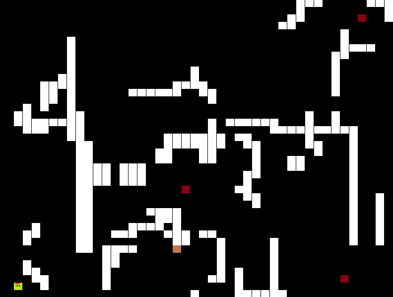
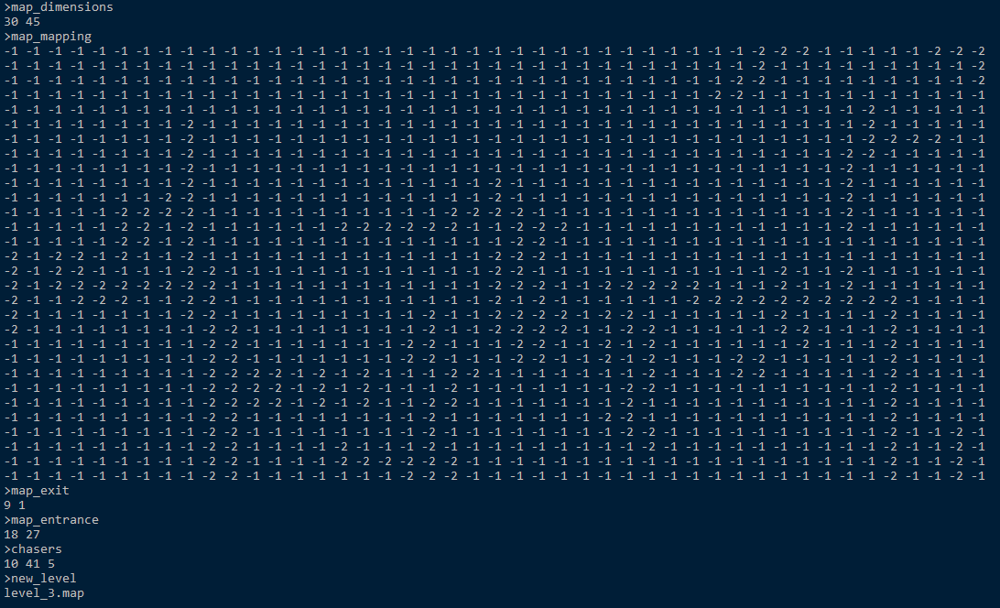

# Paparazzis

Dodge em. That's what you do.
No disrespect to all my hardworking paparazzis out there, this is just a fun little game made to showcase A\* pathfinding algorithm.

---

## PRE-REQUISITES

– The game requires a few external libraries to dynamic linking:

```
libjpeg-9.dll
libpng16-16.dll 
libtiff-5.dll
libwebp-4.dll
SDL2.dll
SDL2_image.dll
zlib1.dll
```

All of which can be found in SDL2 bundle, downloadable at https://www.libsdl.org/download-2.0.php

---

## INSTALLATION

– (Add MingW build instructions here)

– (Add CMake build instructions here, once I learn to use CMake)

---

## DEMO

– Game is easy to play, you have four arrows for control.

– Map is divided into scenes, where player is spawned at the origin square of each scene, and needs to travel to the destination square to lose the paparazzis and exit the scene. Once a level is complete, player enters next scene.



– An important feature is map configuration. You can add/remove levels by adding/removing `.map` files in the the `/maps` folder. Each file represents a whole level. There are 6 fields in each .map file:
1. `map_dimensions`: dimensions (#rows * #columns) of map
2. `map_mapping`: the actual content of level. -1 represents open floor, and -2 represents piece of wall
3. `map_exit`: exit point of each map 
4. `map_entrance`: entry point of each map 
5. `chasers`: configuration of the paparazzis, each of whom is configured with 3 values: first two values represent spawning location [row, column], the 3<sup>rd</sup> value indicates speed
6. `new_level`: file name of next level, end of game if left empty

– Example config map (level\_1.map):




